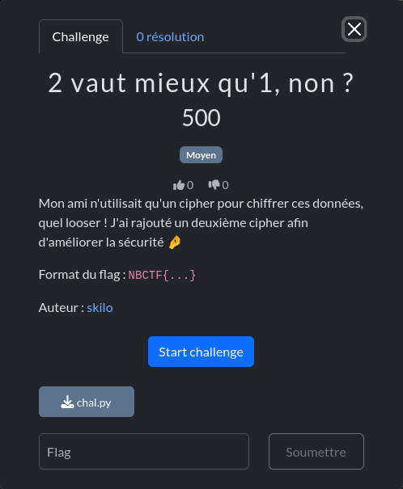
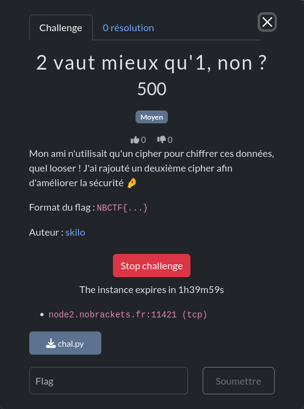

# Déployer un challenge

Les challenges sont divisés en 3 catégories :
- [**Statique**](#challenges-statiques) : Le challenge ne nécessite pas de connexion, tout est à réaliser en local (chez vous).
- [**Globale**](#challenges-globaux) : Le challenge nécessite une connexion à une instance qui est partagée avec tous les joueurs.
- [**Dynamique**](#d%C3%A9ployer-un-challenge-dynamique) : Le challenge nécessite une connexion à une instance qui est dédiée à vous et ne peut être accessible par les autres joueurs (sauf votre équipe).

## Challenges statiques

Pour les challenges statiques, il suffit de télécharger les fichiers associés au challenge et de commencer à résoudre le challenge.

## Challenges globaux

Pour les challenges globaux, il suffit de se connecter à l'instance associée ! Parfois, des fichiers complémentaires peuvent être téléchargés. Ce sont souvent les sources du challenge afin de comprendre son fonctionnement, et trouver ses failles !

### Exemple de challenge web

Dans la capture ci-dessus, ce challenge de *web* propose une URL à attaquer : `http://challenges.nobrackets.fr:10000/`.

Il suffit de cliquer sur le lien pour accéder au challenge !

### Exemple de challenge pwn

Dans la capture ci-dessus, ce challenge de *pwn* propose le téléchargement de trois fichiers :
- `asmble_nationale.asm` : Le fichier source en assembleur.
- `asmble_nationale` : Le fichier binaire compilé.
- `Makefile` : Le Makefile utilisé pour compiler le challenge.

L'exécutable `asmble_nationale` est le fichier que nous allons exploiter, il est disponible à l'adresse `challenges.nobrackets.fr:10201`.
Pour s'y connecter, il suffit de lancer `nc challenges.nobrackets.fr 10201` depuis un terminal (ou depuis la [vm d'attaque](https://wiki.nobrackets.fr/docs/vm)).

## Déployer un challenge dynamique

Pour les challenges dynamiques, une instance est déployée automatiquement à la demande du joueur. Une fois sur la page du challenge, il suffit de cliquer sur le bouton "Start challenge".

Les informations de connexion au challenge s'affichent une fois l'instance déployée.

Dans l'exemple, le challenge est déployé à l'adresse `node2.nobrackets.fr`, sur le port `11421`. Sur ce challenge il n'y a pas de site web, on peut se connecter à l'adresse et au port en utilisant netcat ([nc](https://linuxize.com/post/netcat-nc-command-with-examples/)) ou Python ([pwntools](https://docs.pwntools.com/en/stable/)).

Lorsque le challenge est terminé, cliquer sur le bouton "Stop challenge" pour arrêter l'instance.

Il est possible de déployer 1 challenge par personne. Démarrer une nouvelle instance détruira les anciennes, à l'exception de la [machine d'attaque](https://wiki.nobrackets.fr/docs/vm/) qui peut être déployée en même temps qu'un autre challenge.
