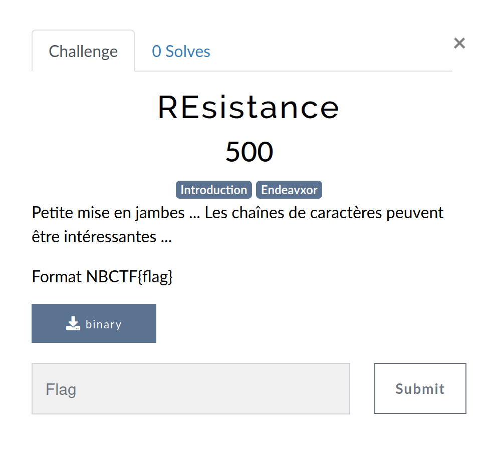
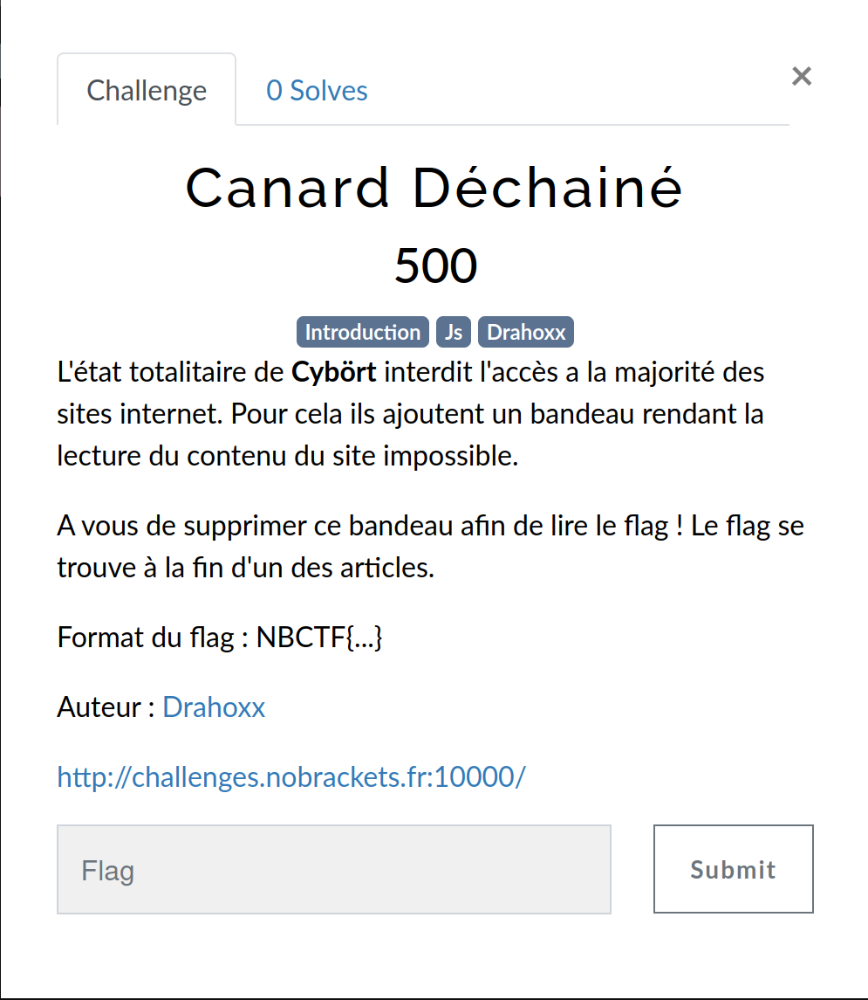
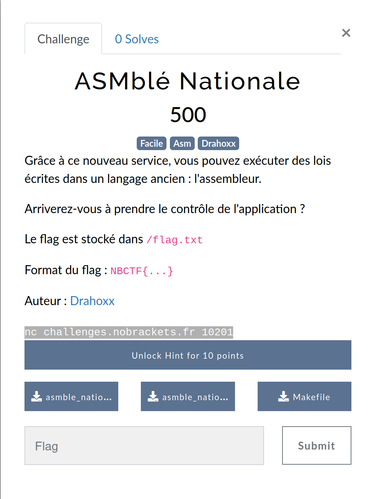
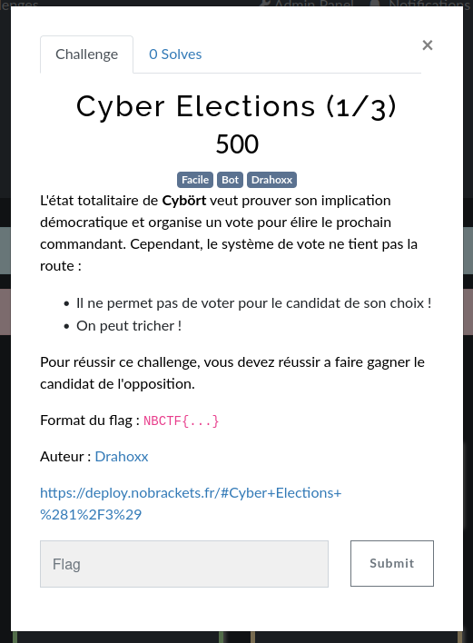
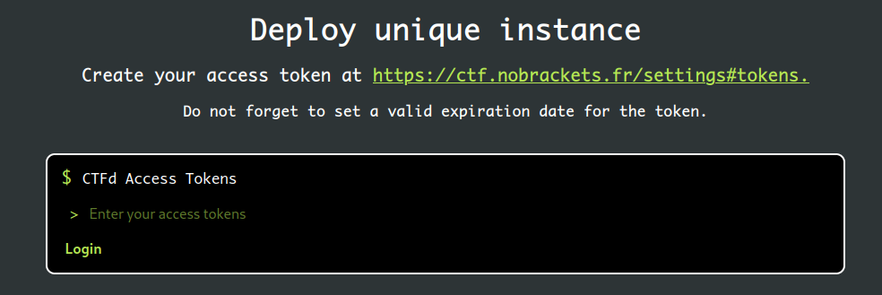
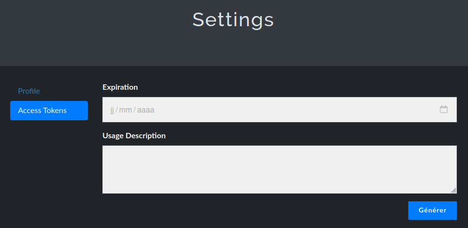
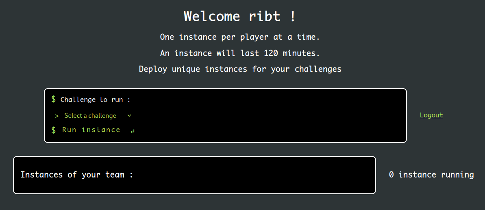
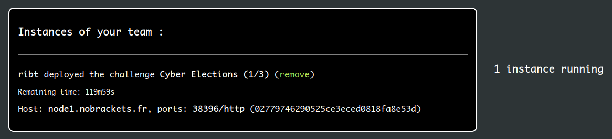

# Déployer un challenge

Les challenges sont divisés en 3 catégories :
- [**Statique**](https://wiki.nobrackets.fr/docs/challenge/#challenges-statiques) : Le challenge ne nécessite pas de connexion, tout est à réaliser en local (chez vous).
- [**Globale**](https://wiki.nobrackets.fr/docs/challenge/#challenges-globaux) : Le challenge nécessite une connexion à une instance qui est partagée avec tous les joueurs.
- [**Dynamique**](https://wiki.nobrackets.fr/docs/challenge/#d%C3%A9ployer-un-challenge-dynamique) : Le challenge nécessite une connexion à une instance qui est dédiée à vous et ne peut être accessible par les autres joueurs (sauf votre équipe).

## Challenges statiques

Pour les challenges statiques, il suffit de télécharger les fichiers associés au challenge et de commencer à résoudre le challenge.

## Challenges globaux

Pour les challenges globaux, il suffit de se connecter à l'instance associée ! Parfois, des fichiers complémentaires peuvent être téléchargés. Ce sont souvent les sources du challenge afin de comprendre son fonctionnement, et trouver ses failles !

### Exemple de challenge web

Dans la capture ci-dessus, ce challenge de *web* propose une URL à attaquer : `http://challenges.nobrackets.fr:10000/`.

Il suffit de cliquer sur le lien pour accéder au challenge !

### Exemple de challenge pwn

Dans la capture ci-dessus, ce challenge de *pwn* propose le téléchargement de trois fichiers :
- `asmble_nationale.asm` : Le fichier source en assembleur.
- `asmble_nationale` : Le fichier binaire compilé.
- `Makefile` : Le Makefile utilisé pour compiler le challenge.

L'exécutable `asmble_nationale` est le fichier que nous allons exploiter, il est disponible à l'adresse `challenges.nobrackets.fr:10201`.
Pour s'y connecter, il suffit de lancer `nc challenges.nobrackets.fr 10201` depuis un terminal (ou depuis la [vm d'attaque](https://wiki.nobrackets.fr/docs/vm)).

## Déployer un challenge dynamique

### Tl;dr

:::info
Pour déployer un challenge dynamique, il faut :
1. Générer un token (https://ctf.nobrackets.fr/settings#tokens)
2. Entrer le token sur la plateforme de déploiement (https://deploy.nobrackets.fr/)
3. Déployer le challenge en sélectionnant le challenge et en cliquant sur "Run instance"
4. Récupérer l'adresse et le port de l'instance
5. Résoudre le challenge !
:::

### Procédure détaillée

Pour les challenges dynamiques, il est nécessaire de déployer une instance du challenge. Pour cela, il faut se rendre sur la plateforme de déploiement : https://deploy.nobrackets.fr/.

Si vous accédez à la plateforme de déploiement pour **la première fois**, vous verrez ce message :

En effet, il est nécessaire de lier la plateforme de déploiement à votre compte sur la plateforme de CTF. Vous pouvez cliquer sur le [lien pour générer un token](https://ctf.nobrackets.fr/settings#tokens). Il est également possible d'aller dans vos paramètres sur https://ctf.nobrackets.fr/ dans le menu "Access Tokens".

Choisissez une date d'expiration après le CTF (par exemple le 31/10/2024), laissez la description vide et cliquez sur "Générer" :
- **Expiration** : 31/10/2024
- **Description** : (Laisser vide)

Votre clé apparaît. Vous pouvez utiliser l'icône à droite pour la copier. Attention, **elle ne vous sera jamais montrée une 2e fois** !

Si vous perdez cette clé, il faudra en regénérer une autre !

:::warning
Attention, cette clé est **PRIVÉE** et ne doit **JAMAIS** être partagée !
:::

Retournez sur https://deploy.nobrackets.fr/ et entrez la clé que vous venez de copier.

Une fois le token rentré, la page ressemble à ça :

Vous pouvez sélectionner le nom du challenge avec le menu déroulant "Select a challenge". Ensuite, cliquez sur "Run instance".

Vous retrouverez la liste des instances déployées par les membres de votre équipe :

Dans mon exemple, le challenge est déployé à l'adresse `node1.nobrackets.fr`, sur le port `38396`. Comme le challenge présente un site web, je dois résoudre le challenge en visitant l'URL `http://node1.nobrackets.fr:38396/`. Pour les autres types de challenge, il peut être nécessaire de se connecter à l'adresse et au port en utilisant netcat ([nc](https://linuxize.com/post/netcat-nc-command-with-examples/)) ou Python ([pwntools](https://docs.pwntools.com/en/stable/)).
