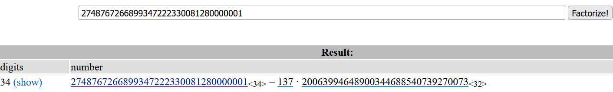

# Attaques cryptographiques - Quelques outils

Les algorithmes de cryptographie se basant principalement sur des concepts mathématiques, si certaines conditions ne sont plus respectées, il devient alors possible de casser le système et de retrouver le message chiffré, la clé secrète...


## Chiffrement par décalage et par substitution
Les chiffrements par décalage comme César ne sont plus utilisés depuis longtemps de par leur manque de sécurité. En effet, il est très facile dans un chiffrement par décalage de tester toutes les combinaisons possibles et retrouver le message originel.

Concernant les chiffrements par substitution, comme Vigenère, il est possible de calculer les fréquences de chaque lettre et d'en déduire la lettre correspondante. En français, le `e` étant la lettre la plus utilisée, si notre texte chiffré contient un très grand nombre de `g`, il y a de grandes chances que le `e` a été remplacée par un `g`.

On trouve facilement sur Internet des outils qui automatisent ces analyses :
- https://www.dcode.fr/ 
- https://www.boxentriq.com/

## RSA
La sécurité de RSA se base principalement sur le fait qu'il soit compliqué de factoriser `n`. En effet, si `n` est factorisable simplement, on retrouve alors `p` et `q`, et il suffit de dérouler l'algorithme pour déchiffrer le message.

Il existe des algorithmes pour optimiser la factorisation. Cependant, plus `n` est grand, plus le temps d'exécution sera long. Il est donc généralement impossible d'appliquer cette méthode. https://www.codedrome.com/factorization-in-python/ 
L'outil factordb (http://factordb.com/) peut également s'avérer utile pour factoriser de grand nombre. Le site web possède une large base de données de nombre déjà factorisé.

Exemple :
On a :
```py
p = ?
q = ?

n = p*q = 2748767266899347222330081280000001
e = 15

## Calcul de la clé privée d
phi = (p-1)*(q-1)
d = pow(e,-1,phi)

print(f"Clé publique : (n,e) = ({n},{e})")
print(f"Clé privée : (p,q,e,d) = ({p},{q},{e},{d})")

MESSAGE = ?

MES_CHIFFRE = pow(MESSAGE, e, n) = 296669482118206006359299234438535
```
On teste tout d'abord si n est factorisable. On utilise pour cela factordb :

Il existe une factorisation connue ! On connait donc p et q. Il suffit donc de déchiffrer :
```py
p = 137
q = 20063994648900344688540739270073

n = p*q = 2748767266899347222330081280000001
e = 15
MES_CHIFFRE = 296669482118206006359299234438535

## Calcul de la clé privée d
phi = (p-1)*(q-1)
d = pow(e,-1,phi)

## On retrouve le message original
MESSAGE = pow(MES_CHIFFRE, d, n) = 123456
```


Il existe de nombreuses autres attaques possibles :
- le module `n` est commun à plusieurs messages;
- un même message est envoyé à plusieurs destinataires;
- l'exposant e est trop petit;
- l'exposant d est trop petit;
- leak d'une partie des paramètres `p` ou `q`...

Vous trouverez plus d'informations à travers ces liens :
- https://nitaj.users.lmno.cnrs.fr/CryptRSA.pdf 
- https://repository.root-me.org/Cryptographie/EN%20-%20Attack%20on%20RSA%20Cryptosystem%20-%20Sachin%20Upadhyay.pdf 

## AES
La plupart des attaques sur AES se basent sur un raisonnement logique. Le système AES possédant plusieurs modes, chacun de ces modes possède ses propres vulnérabilités.

Le mode ECB est, par exemple, vulnérable aux attaques par clair choisi. Lors de cette attaque, l'attaquant va profiter du fait qu'il puisse chiffrer lui-même ses messages pour tenter de faire leaker le message caché. Vous trouverez plus de détails dans ces tutoriels :
- https://zachgrace.com/posts/attacking-ecb/
- https://dr3dd.gitlab.io/cryptography/2018/10/11/Simple-Attack-On-AES-ECB-Mode/

## Conclusion

Le langage python est communément utilisé pour effectuer ce type d'attaques en cryptographie. En effet, il existe de nombreuses librairies qui permettent de vous faciliter la vie :
- Pour convertir un nombre en caractères : https://pycryptodome.readthedocs.io/en/latest/src/util/util.html#Crypto.Util.number.long_to_bytes
- Pour chiffrer et déchiffrer de l'AES : https://pycryptodome.readthedocs.io/en/latest/src/cipher/aes.html

Pour des calculs mathématiques plus avancés, il est possible d'utiliser sagemath (Sur-couche à python):
- Librairie : https://www.sagemath.org/fr/ 
- En ligne : https://sagecell.sagemath.org/

N'oubliez pas qu'on ne vous demande pas de réinventer la cryptographie ou la cryptanalyse. Il existe de nombreuses ressources, tutoriels, write-ups d'anciens challenges... sur internet qui peuvent aider et vous guider dans la résolution de vos challenges.