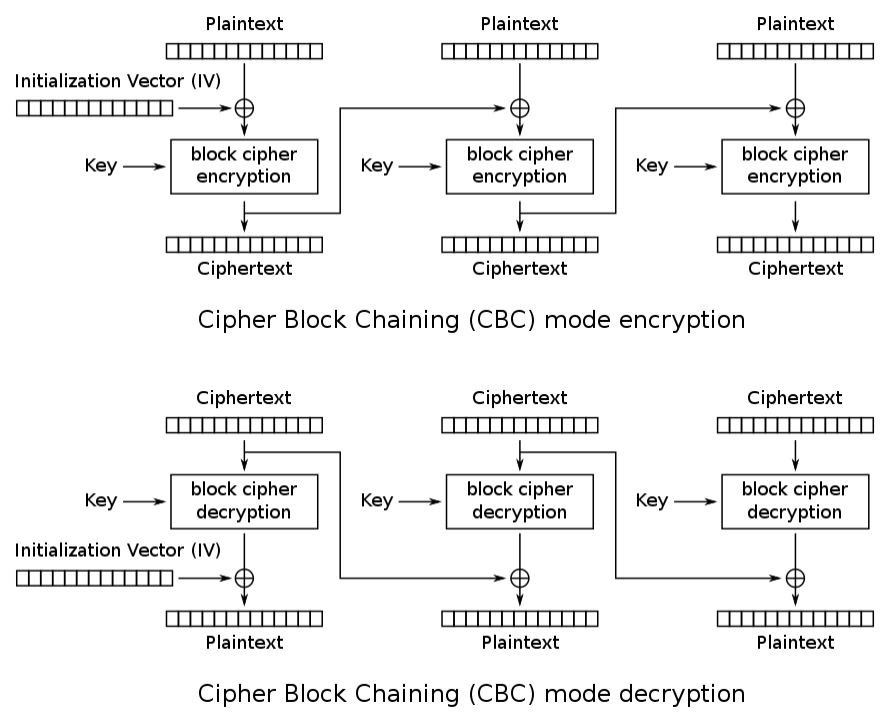

# Les Cryptosystèmes

Il existe à ce jour 2 grandes familles de cryptosystèmes : 
- la cryptographie symétrique;
- la cryptographie asymétrique.

Dans un système se basant sur la cryptographie symétrique, les 2 personnes qui communiquent (on nomme Alice et Bob en général) partage un secret commun. Cela peut donc être une clé, un mot de code...
En cryptographie asymétrique, chacun possède une clé privée, qui doit impérativement rester secrète, et une clé publique (La clé publique est en revanche connue de tous). 

Vous trouverez ici un petit aperçu des différents algorithmes existants.

## Cryptographie par décalage et par substitution

A noter, qu'aujourd'hui, ces systèmes ne sont absolument pas sécurisés. Ils ne sont donc pas utilisés pour des usages réels.

### César
Le principe du chiffrement César est d'effectuer un décalage régulier sur les lettres de l'alphabet. Ainsi, si on choisi un décalage de 2 lettres, le message "BONJOUR" va devenir "DQPLQWT". 
Ce système est extrêmement vulnérable car il est très facile de tester tous les décalages possibles et ainsi que retrouver le message initial.

Quelques liens pour en savoir plus : 
- https://www.dcode.fr/chiffre-cesar 
- https://fr.wikipedia.org/wiki/Chiffrement_par_d%C3%A9calage

### Vigenère
Le chiffre de Vigenère va lui utiliser un alphabet de substitution. Ainsi, chaque lettre de l'alphabet sera remplacée par une autre lettre prédéfinie. Si on choisi les substitutions suivantes "A => F; B => P; C => K", le message "ABCA" va devenir "FPKF".

Vous retrouverez un détail des attaques possibles dans les pages suivantes.

Un lien pour en savoir plus : 
- https://fr.wikipedia.org/wiki/Chiffre_de_Vigen%C3%A8re

## Cryptographie symétrique

### AES
Le chiffrement AES est un chiffrement par bloc, c'est à dire que le message sera découpé en blocs, chaque bloc étant chiffré plus ou moins indépendamment.
L'algorithme en lui même effectue une suite d'opérations non-linéaire ce qui permet de rendre le déchiffrage impossible sans connaître la clé. 

Le chiffrement AES possède également plusieurs modes différents qui modifie le comportement du chiffrement en dehors de l'algorithme principal.

Le mode CBC est particulièrement  courant car jugé plus sécurisée que ces autres acolytes. Chaque bloc (plaintext) est tout d'abord xorée avec le bloc chiffré (ciphertext) précédent.


En python, il est possible d'utiliser la librairie `pycryptodome` pour utiliser AES :
```py
from Crypto.Cipher import AES

# La clé doit impérativement faire 16 caractères
key = b'Voici une cle...'
iv = b'Voici un vecteur'

cipher = AES.new(key, AES.MODE_CBC, iv)

plaintext = b"voici un message"

ciphertext = cipher.encrypt(plaintext)

print(ciphertext)
# Résultat : b'R\xcd"\x14\xc7\xaf\xab\xe7\'\xed\xde\xa3\xbd,p)'

cipher = AES.new(key, AES.MODE_CBC, iv)

recover_plain = cipher.decrypt(ciphertext)

print(recover_plain)
# Résultat : b'voici un message'
```

Quelques liens pour en savoir plus : 
- https://fr.wikipedia.org/wiki/Advanced_Encryption_Standard
- https://fr.wikipedia.org/wiki/Mode_d%27op%C3%A9ration_(cryptographie)
- https://pycryptodome.readthedocs.io/en/latest/src/cipher/aes.html

## Cryptographie asymétrique

### RSA
Le chiffrement RSA est un chiffrement asymétrique, c'est-à-dire que chaque utilisateur possède une clé privée ainsi qu'une clé publique. 

Voici un petit aperçu mathématique du fonctionnement de RSA :
- On choisit `p` et `q`, 2 nombres premiers (Généralement grand).
- On choisit `e`, premier également. On appelle `e` l'exposant publique.
- On calcule $n = p*q$. On appelle `n` le module.
- On calcule $phi = (p-1)*(q-1)$
- On calcule ensuite l'exposant privé `d` : $d = e^{-1} \pmod phi$

- Enfin, on chiffre un message avec : $C = M^e \pmod n$ et on déchiffre avec : $M = C^d \pmod n$

La clé publique est constituée de `n` et `e`, tandis que la clé privée est constituée de `p`, `q` et `d`.

Vous trouverez un exemple d'attaque dans les pages suivantes.

Quelques liens pour en savoir plus : 
- https://fr.wikipedia.org/wiki/Chiffrement_RSA 
- https://www.dcode.fr/chiffre-rsa


### Autres

Il existe bien d'autres cryptosystèmes plus ou moins complexe à comprendre et à manipuler.
- Chiffrement Diffie-Hellman : https://fr.wikipedia.org/wiki/%C3%89change_de_cl%C3%A9s_Diffie-Hellman 
- Cryptographie sur les Courbes Elliptiques (ECC) : https://fr.wikipedia.org/wiki/Cryptographie_sur_les_courbes_elliptiques 
- Cryptographie post-quantique basée sur les réseaux euclidiens, les codes correcteurs d'erreurs ou bien les isogénies : https://fr.wikipedia.org/wiki/Cryptographie_post-quantique 
- ...