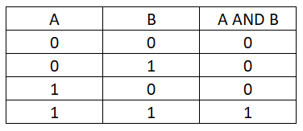
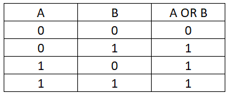
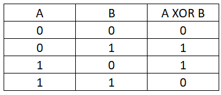
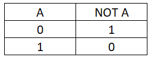

# Quelques notions mathématiques

## Arithmétique
### Le module
Le modulo est une opération qui permet de retourner le reste de la division euclidienne de `a` par `b` :
$a = b*k + r \Leftrightarrow a = r \pmod b$

Exemple : $16 = 5*3 + 1 \Leftrightarrow 16 = 1 \pmod 5$

Dans le cas où `r` est à 0, on dit que `b` divise `a`.

Quelques liens :
- https://www.annales2maths.com/terminale-divisibilite-dans-z-et-congruences/
- https://www.youtube.com/watch?v=BByKm1u16qs 

### Le PGCD
Le Plus Grand Diviseur Commun se calcule entre 2 nombres. Comme le nom l'indique, c'est le plus grand diviseur commun aux 2 nombres. 

Exemple : $PGCD(18,16) = 2$ car `$$18 \equiv 3*3*2$$`` et $$16 \equiv 2*2*2*2$$.

$PGCD(101,50) = 1$ car $101 \equiv 101$ et $50 \equiv 2*5*5$, 1 est le seul diviseur commun. Dans ce cas, on dit que 101 et 50 sont premiers entre eux.

Quelques liens :
- https://fr.wikipedia.org/wiki/Plus_grand_commun_diviseur
- https://www.annales2maths.com/terminale-pgcd-et-applications/
- https://www.youtube.com/watch?v=TWYv8aKKYls

### Les nombres premiers
Un nombre est dit premier si il n'est divisible que par 1 et par lui-même.
```
2,3,5,7,11,13...
```
Les nombres premiers possède de nombreuses propriétés spécifiques très intéressantes.

Quelques liens :
- https://fr.wikipedia.org/wiki/Nombre_premier
- https://www.annales2maths.com/terminale-cours-nombres-premiers/
- https://www.youtube.com/watch?v=BhH8zE9e4Tw 

### L'inverse modulaire
`v` est l'inverse modulaire de `u` modulo `n` si $u*v = 1 \pmod n \Leftrightarrow u = v^{-1} \pmod n$.

En python, on peut le calculer ainsi :
```py
u = pow(v,-1,n)
```
Cette opération est notamment utilisé dans le chiffrement RSA.

Quelques liens : 
- https://fr.wikipedia.org/wiki/Inverse_modulaire
- https://www.youtube.com/watch?v=NGSdl7y4wdI

## Logique
### Représentation binaire
Nous utilisons communément la base 10 pour calculer ou bien communiquer. Cependant, il existe d'autres bases.

En base 10, le nombre 346 peut se décomposer ainsi : 
$346 \equiv 3*100 + 4*10 + 6*1 \equiv 3*10^2 + 4*10^1 + 6*10^0$

Ainsi, en base 2 (ou binaire), c'est la même chose : 
$(1011)_2 \equiv 1*2^3 + 0*2^2 + 1*2^1 + 1*2^0 \equiv 8 + 2 + 1 = 11$

Cette représentation est utilisée par les ordinateurs.

Il existe également les bases 16, 8... qui se décomposent de la même manière.

Quelques liens :
- https://fr.wikipedia.org/wiki/Syst%C3%A8me_binaire

### Les opérations logiques

En mathématiques, on utilise généralement des opérations telles que l'addition (+), la multiplication (x)... Il existe également des opérations logiques. Le résultat des opérations logiques est toujours constitué d'un de ces 2 éléments {VRAI, FAUX} ou {1,0} appelés valeurs de vérité.

Il est possible d'établir des tables de vérité.

- Opération AND :

Le résultat S est à 1 (VRAI) seulement si A et B sont également à 1.


- Opération OR :

Le résultat S est à 1 (VRAI) seulement si A, B, ou les deux sont à 1.


- Opération XOR :

Le résultat S est à 1 (VRAI) seulement si A et B sont la négation de l'autre (1,0) ou (0,1).


- Opération NOT :

Le résultat S est la négation de la valeur de A.



Quelques liens :
- https://fr.wikipedia.org/wiki/Table_de_v%C3%A9rit%C3%A9
- https://fr.wikipedia.org/wiki/Alg%C3%A8bre_de_Boole_(logique)