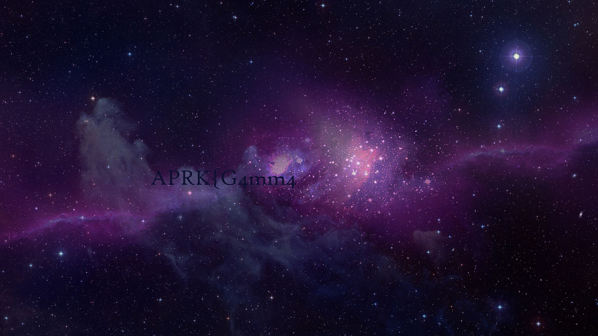
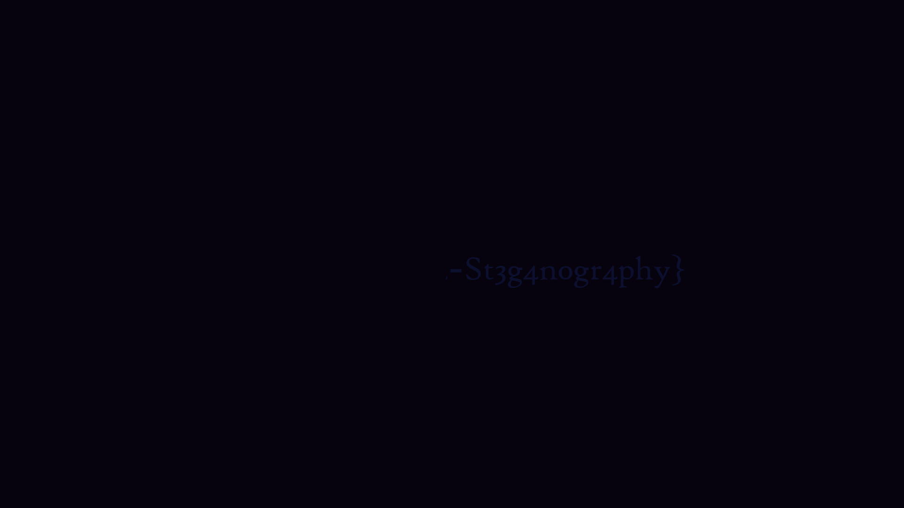
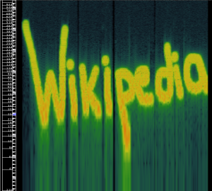

# Introduction à la Stéganographie

La [stéganographie](https://fr.wikipedia.org/wiki/Stéganographie) est une forme de dissimulation (ou d'offuscation) d'information dans le but de transmettre un message de manière inaperçue au sein d'un autre message. L'information utile est cachée au premier abord et à l'œil nu, mais non protégée pour qui sait où regarder.
Pour prendre une métaphore, la stéganographie consisterait à enterrer son argent dans son jardin là où la cryptographie consisterait à l'enfermer dans un coffre-fort. Cela dit, rien n'empêche de combiner les deux techniques, de même que l'on peut enterrer un coffre dans son jardin.

## Différence entre cryptographie et stéganographie

Alors que la cryptographie consiste en une écriture indéchiffrable d'un message ou d'une information (ainsi rendue secrète), la stéganographie va plutôt s'attacher à cacher un message dans un contenu pour qu'il soit, non pas indéchiffrable, mais indiscernable.

## Les différents types de stéganographie et leurs supports

Il existe deux types de stéganographie, physiques et numérique.
Un exemple de stéganographie physique serait [la scytale spartiate](https://www.apprendre-en-ligne.net/crypto/transpo/scytale.html) un procédé qui consistait à enrouler une bande de cuir autour d'un bâton pour déchiffrer le message écrit dessus.
Mais pour des raisons évidentes de praticité, on se concentrera plutôt sur les méthodes numériques dans ce wiki.

### Les différents types de support
Comme dit plus tôt, la stéganographie consiste à cacher un message ou une donnée dans un élément déjà existant.
De fait, la connaissance des différents supports permettant de cacher de l'information est importante.

#### Les messages transportés dans un texte
L'utilisation de la stéganographie dans les textes pour cacher des informations est la plus ancienne de ses utilisations.
Comme mentionné plus tôt avec la scytale spartiate, le procédé existait déjà durant l'Antiquité.
Il fut ensuite repris par les hommes d'Église principalement, puis plus récemment par les [écrivains et poètes](https://www.monde-fantasy.com/les-messages-codes-la-steganographie/) qui on fait évoluer le procéder.
__Exemple :__
Si l'on lit uniquement un ver sur deux de cette lettre écrite par George SAND à Alfred de Musset
On comprend les véritables intentions de Madame.

**Je suis très émue de vous dire que j’ai**
bien compris l’autre soir que vous aviez
**toujours une envie folle de me faire**
danser. Je garde le souvenir de votre
**baiser et je voudrais bien que ce soit**
là une preuve que je puisse être aimée
**par vous. Je suis prête à vous montrer mon**
affection toute désintéressée et sans cal-
**cul, et si vous voulez me voir aussi**
vous dévoiler sans artifice mon âme
**toute nue, venez me faire une visite.**
Nous causerons en amis, franchement.
**Je vous prouverai que je suis la femme**
sincère, capable de vous offrir l’affection
**la plus profonde comme la plus étroite**
en amitié, en un mot la meilleure preuve
**dont vous puissiez rêver, puisque votre**
âme est libre. Pensez que la solitude où j’ha-
**bite est bien longue, bien dure et souvent**
difficile. Ainsi en y songeant j’ai l’âme
**grosse. Accourez donc vite et venez me la**
faire oublier par l’amour où je veux me
**mettre.**

Voici une liste de manipulation réalisable sur le support :
- Modulation fine d'un texte écrit
- Marquage de caractères
- Codage sous forme d'une apparence de spam ou d'un texte biblique
- Utilisation de caractère invisible

##### Ressources :
[https://fr.wikipedia.org/wiki/Langage_de_programmation_exotique](https://fr.wikipedia.org/wiki/Langage_de_programmation_exotique)
[https://www.spammimic.com/explain_fr.shtml](https://www.spammimic.com/explain_fr.shtml)

#### Les messages transportés dans une image
Les images ne sont qu'un amas de pixels, eux-mêmes composé de 0 et de 1.
En partant de ce constat, on peut facilement deviner qu'elles peuvent être un vecteur d'information très utile.
Par exemple, en fonction de l'outil que l'on utilise pour l'afficher, on peut avoir deux résultats totalement différents.
Voici une image ouverte avec deux visionneurs différents qui réalise une correction différente sur le gamma de ladite image :

Pour plus de détails/explication voir [Gamma Steganography](https://carlmastrangelo.com/blog/gamma-steganography) et [Gamma error in picture scaling](http://www.ericbrasseur.org/gamma.html)
Bon nombre de manipulations peuvent être appliqué sur l'ensemble des formats d'image (PNG, JPG, GIF, WEBP...) comme l'exemple ci-dessus.

Voici une liste de manipulation réalisable sur le support :
- Manipulation des bits d'une image (bits de poids faible/fort)
- Manipulation de la palette de couleurs d'une image
- Message caché dans les images compressées
- Optimisation de l'emplacement du message caché dans une image

##### Ressources :
[https://ctf-wiki.mahaloz.re/misc/picture/introduction/](https://ctf-wiki.mahaloz.re/misc/picture/introduction/)

#### Les messages transportés dans un enregistrement
Dans les formats sonores, il existe à peu près les mêmes possibilités de cacher des messages que dans les images. Dans un fichier sonore au format MIDI, il n'existe pas de palette de couleurs, mais bien différentes pistes qui peuvent être permutées.
De ce fait, on est capable de cacher des informations dans le spéctrogramme des enregistrements par exemple :

Il est possible de réaliser des opérations sténographiques sur différents types d'enregistrement :

- Audio : [https://nsspot.herokuapp.com/imagetoaudio/](https://nsspot.herokuapp.com/imagetoaudio/)

- Vidéo : [https://ctf-wiki.mahaloz.re/misc/audio/introduction/](https://ctf-wiki.mahaloz.re/misc/audio/introduction/)

#### Les message transporté dans un binaire

Voici une liste de manipulation réalisable sur le support :

- Insertion de bits de données dans des bits de remplissage : 
    Cette méthode consiste à insérer les bits du message dans les bits de remplissage d'un fichier binaire. Les bits de remplissage sont généralement utilisés pour maintenir une taille de fichier constante. En modifiant les bits de remplissage, il est possible d'y dissimuler un message sans affecter de manière significative le fonctionnement du fichier.

- Modification de l'en-tête ou des métadonnées : 
    Certains fichiers binaires et exécutables ont des en-têtes ou des métadonnées qui ne sont pas essentielles à leur exécution. En modifiant ces données, vous pouvez intégrer un message.

- Techniques de modification des octets de code :
    Pour les fichiers exécutables, il est possible de cacher des données en modifiant les octets de code ou les opcodes. Cette technique peut être complexe, car il faut s'assurer que les modifications ne causent pas de problèmes de fonctionnement du fichier exécutable. Les emplacements appropriés pour insérer les données dépendent de la structure du binaire.

## Ressources
### Image
- [https://stegonline.georgeom.net/upload](https://stegonline.georgeom.net/upload)
- [https://futureboy.us/stegano/](https://futureboy.us/stegano/)
### Liste de tools
- [https://0xrick.github.io/lists/stego/](https://0xrick.github.io/lists/stego/)
- [https://k-lfa.info/tools-stegano/](https://k-lfa.info/tools-stegano/)
- [https://ctf-wiki.mahaloz.re/](https://ctf-wiki.mahaloz.re/introduction/resources/)
- [https://book.hacktricks.xyz/crypto-and-stego/stego-tricks](https://book.hacktricks.xyz/crypto-and-stego/stego-tricks)
- [https://fareedfauzi.gitbook.io/ctf-playbook/steganography](https://fareedfauzi.gitbook.io/ctf-playbook/steganography)