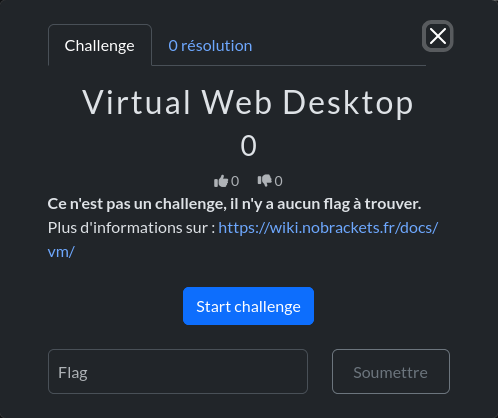
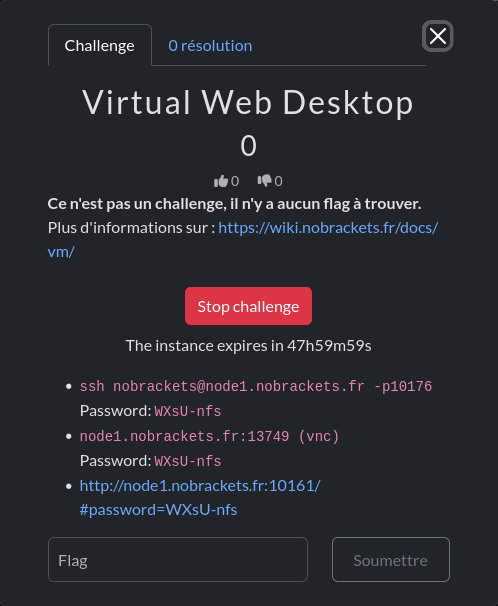
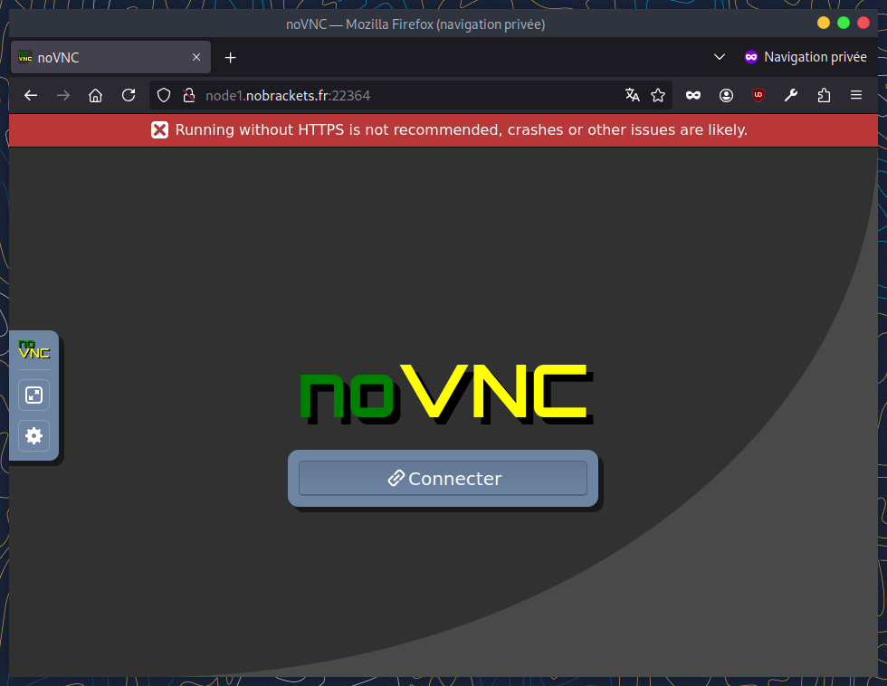
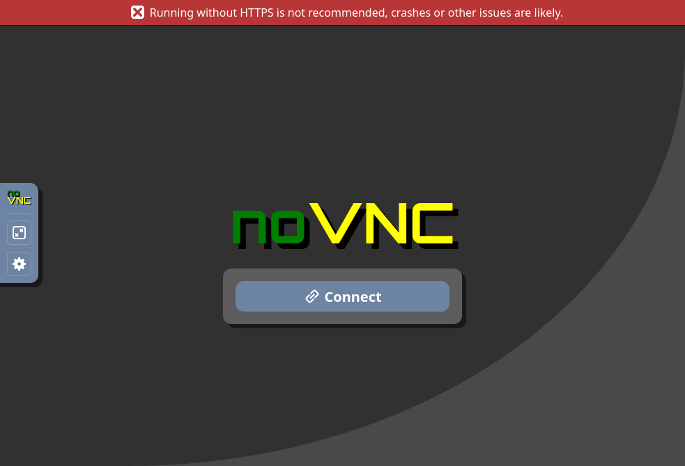

# La machine d'attaque

Si vous ne souhaitez ou ne pouvez pas installer sur votre ordinateur personnel les outils nécessaires pour réaliser les challenges, nous mettons à votre disposition une machine virtuelle permettant de réaliser les challenges.

Liste non exhaustive des outils installés sur la machine : Wireshark, nmap, John The Ripper, Audacity, exiftool, binwalk, jwt_tool, peda, pwndbg, stegsolve etc.

## Lancer une machine

La procédure pour démarrer une machine d'attaque est similaire à celle des challenges dynamiques (voir [ici](https://wiki.nobrackets.fr/docs/challenge/#d%C3%A9ployer-un-challenge-dynamique)).

* Sélectionner le challenge "Virtual Web Desktop" puis cliquer sur "Start challenge".

* Plusieurs services sont exposées : un SSH, un VNC et un VNC à travers un site web.

* Pour ouvrir le VNC dans le navigateur cliquer sur le lien.

:::warning
Le lien contient le mot de passe pour accéder au VNC et se connecter à la machine d'attaque, ne le partagez pas aux autres équipes.
:::

* Cliquer sur "Connecter".

* Félicitations vous avez accès à la machine d'attaque !

* Vous pouvez utiliser le navigateur par défaut ou Firefox pour vous rendre sur https://ctf.nobrackets.fr/, vous connecter et commencer à résoudre des challenges !
