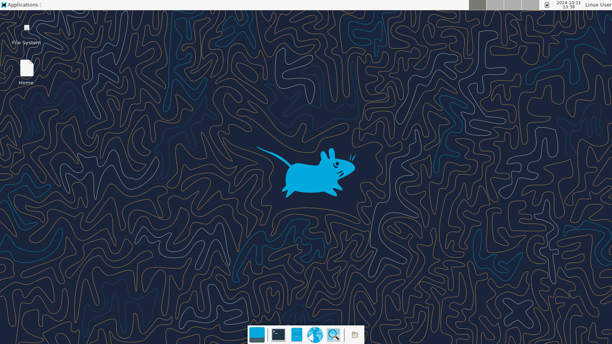

# La machine d'attaque

Si vous ne souhaitez ou ne pouvez pas installer sur votre ordinateur personnel les outils nécessaires pour réaliser les challenges, nous mettons à votre disposition une machine virtuelle permettant de réaliser les challenges.

Liste non exhaustive des outils installés sur la machine : Wireshark, nmap, John The Ripper, Audacity, exiftool, binwalk, jwt_tool, peda, pwndbg, stegsolve etc.

## Lancer une machine

* Aller sur https://deploy.nobrackets.fr/

* Si ce n'est pas fait, entrer son token CTFd. Pour plus d'informations : [visiter cette page](./challenge).

* Dans le menu déroulant, sélectionner "Virtuel Web Desktop" puis cliquer sur "Run instance".

* Dans les informations qui apparaissent, noter la valeur de "Host", le port http et le mot de passe. 

* Ouvrir un nouvel onglet et entrer l'URL `http://HOST:PORT` (dans mon exemple, entrer `http://node1.nobrackets.fr:22364/`).

* Cliquer sur "Connecter".

* Entrer le mot de passe noté précédemment.

* Félicitations vous avez accès à la machine d'attaque !

* Vous pouvez utiliser le navigateur par défaut ou Firefox pour vous rendre sur https://ctf.nobrackets.fr/, vous connecter et commencer à résoudre des challenges !